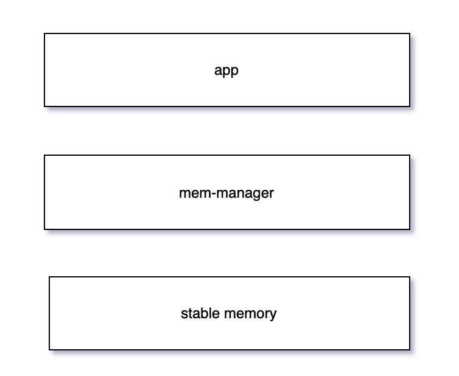
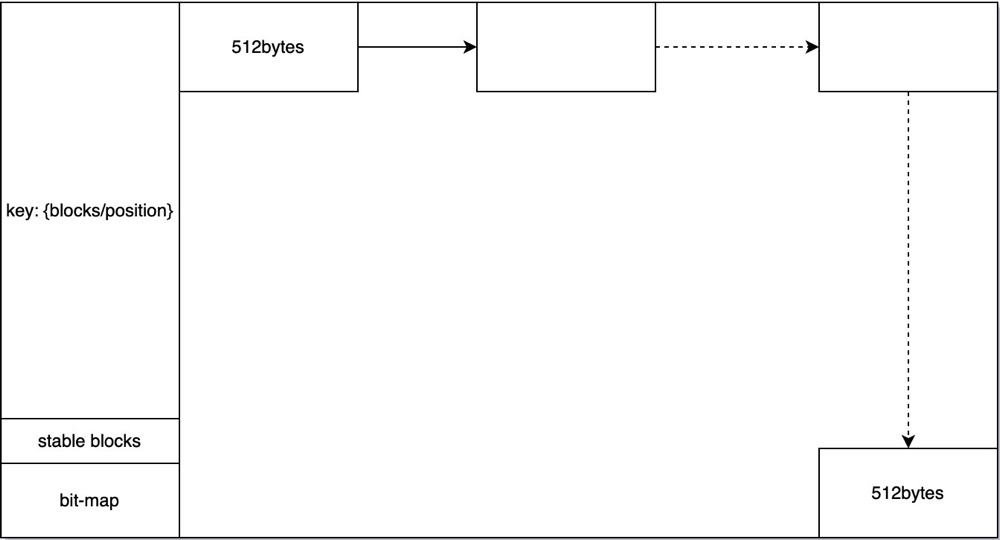

# V2 features
- Reserve 20MB space to store bucket index
- The maximum available stable storage space is 8GB
- GB level data storage, using the put interface
- To store data in the key/value format
- you can delete the key and release the stable storage space corresponding to the value (the freed space is not returned to the ic network) for use by other keys.
- The space allocated from the ic network is managed according to the mode of the file system to manage the disk, so the space will be divided into blocks of 512bytes size
- Waring !!!If you want to upgrade normally, you need to call check_upgrade or get_index_space to see how much index space is currently occupied
- logical architecture



- file system layout 




# How to use
```
    use kv;
    let name = "test".to_stirng();
    let data : Vec<u8> = vec![0,100];
    
    match kv::append(&name, data) {
        Ok(..) => {}
        Err(err) => {
            api::print(format!("upload data err:{:?}", err));
            assert!(false)
        }
    }
    
    match  kv::get(&name){
        Ok(_data) =>{}
        Err(_err) =>{}
    }
    
    kv::del(&name);

```


# cycle limit
Due to the maximum cycle limit per update, the block size used inside the kv repository and the amount of data that can be read and written at most once are shown in the following table，The current default size of kv_block_size is 512 bytes.

|kv_block_size|32 |  64  | 128 | 512|
|---| ----| ----| ----|----|
|max_length| 8MB |  16MB | 32MB |  128MB |

# v3 features
- Only use the secondary index to store a large amount of index data
- User can customize the size of kv_block_size
